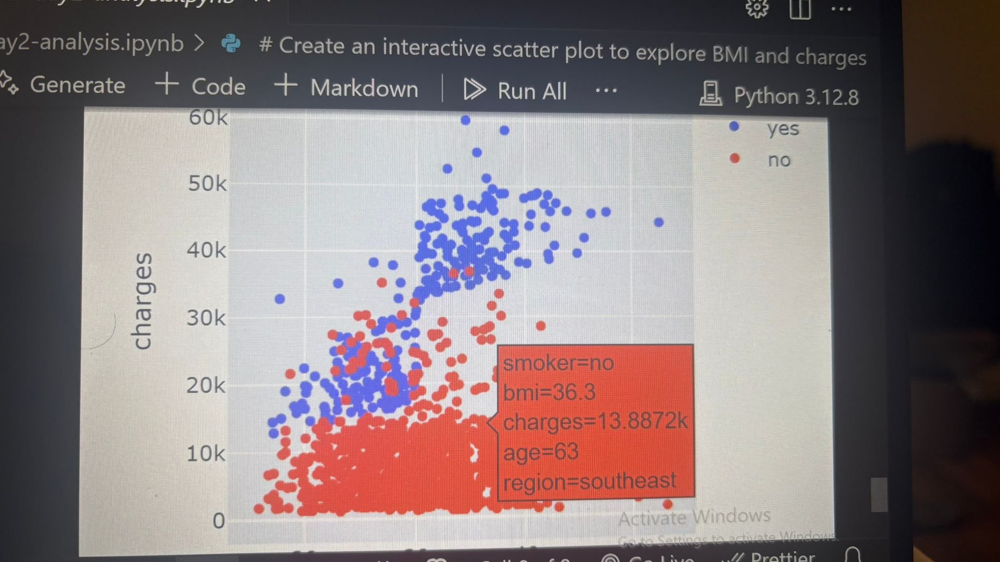

# Healthcare Insurance Cost Analysis

## Overview

Healthcare Insurance Cost Analysis is a data analytics project focused on exploring how personal and regional factors influence healthcare insurance charges.  
The project follows a two-day development structure including ETL, data cleaning, visualisation, and documentation.

---

## Project Management (Day 1)

During the first day, the following setup and management steps were completed:

### 1. Project Idea

- The selected project is Healthcare Insurance Cost Analysis.
- The goal is to explore how personal and regional factors influence healthcare insurance charges and to prepare data for predictive analysis.

### 2. Repository Setup

- A GitHub repository was created named H1_Health_Analytics.
- Main folders and files:
  - `data/` → for storing datasets
  - `notebooks/` → for Jupyter Notebooks
  - `day1-analysis.ipynb` → ETL and visualisation work
  - `README.md` → documentation and reporting

### 3. Project Board and Workflow

A GitHub Project Board was used for task management with a Kanban workflow:

- Backlog: Ideas and tasks not yet started
- To Do: Planned tasks for the day
- In Progress: Ongoing work
- Done: Completed items

### 4. Labels and Prioritisation (MoSCoW)

Each issue was labeled by priority:

- Must Have: ETL process, data cleaning
- Should Have: Basic visualisations
- Could Have: Styling and improvements
- Won’t Have: Postponed tasks

### 5. Progress Monitoring

- Milestones and labels were used to track progress.
- Folder path issues were fixed successfully during Day 1.

---

## ETL Process

### Extract

- Dataset: [Kaggle – Healthcare Insurance Dataset](https://www.kaggle.com/datasets/willianoliveiragibin/healthcare-insurance)
- Contains 1,338 rows and 7 columns: age, gender, BMI, children, smoker, region, and charges.
- Issue: A small path error occurred while loading the CSV file and was fixed after debugging with ChatGPT.

### Transform

- Checked for duplicate records and removed them.
- Standardised column names to lowercase.
- Created a new column BMI_category:
  - Underweight: <18.5
  - Normal: 18.5–24.9
  - Overweight: 25–29.9
  - Obese: ≥30

### Load

- Cleaned dataset saved as `insurance_cleaned.csv` in the `data/` folder.

---

## Data Visualisation (Day 1)

Initial visualisations were created using Matplotlib, Seaborn, and Plotly.

Issue: The `df` variable was lost after restarting the notebook; solved by reloading the dataset with help from ChatGPT.

### 1. Age Distribution

- Tool: Matplotlib
- Purpose: Show distribution of ages.
- Insight: Most policyholders are between 20–50 years old.

### 2. Charges by Smoking Status

- Tool: Seaborn (Boxplot)
- Purpose: Compare insurance charges by smoker status.
- Insight: Smokers pay higher insurance costs.

### 3. Average Charges by Region

- Tool: Plotly
- Purpose: Display average charges per region.
- Insight: The Southeast region has the highest average charges.

### 4. Interactive Scatter Plot – BMI vs Charges

- Tool: Plotly Express
- X-axis: BMI
- Y-axis: Charges
- Color: Smoker status
- Hover Data: Age, Region
- Insight: Smokers with higher BMI pay significantly more for insurance.

---

## ETL Pipeline Validation (Day 2)

Day 2 focused on validating the ETL process and ensuring all data transformations were consistent.

### Steps

1. Extract: Reloaded `insurance_cleaned.csv`.
2. Issue: The dataset was initially not linked properly; fixed by correcting the file path.
3. Transform: Checked column names, duplicates, and data types.
4. Load: Data validated and ready for analysis.

### Reflection

The loading issue improved understanding of managing file paths in Jupyter Notebook.  
After debugging, the ETL pipeline worked perfectly.

---

## Advanced Visualisations (Day 2)

Day 2 visualisations explored deeper relationships between demographic and lifestyle factors.

### 1. Correlation Heatmap

- Tool: Seaborn
- Purpose: Show correlations between age, BMI, and charges.
- Insight: BMI and smoking status show the strongest positive correlation with charges.

### 2. Pair Plot

- Tool: Seaborn
- Purpose: Show multiple relationships (age, BMI, charges).
- Insight: Smokers have higher BMI and higher charges.

### 3. Interactive Scatter Plot – BMI vs Charges

- Tool: Plotly Express
- Purpose: Explore effect of BMI and smoking on charges.
- Hover Data: Age, Region
- Insight: Confirms BMI and smoking greatly increase costs.

### 📊 Interactive Scatter Plot (BMI vs Charges)

### Reflection

- Challenge: Cleaned data was not loading correctly at first.
- Solution: Verified ETL pipeline and reloaded data successfully with ChatGPT’s help.
- Final visualisations were validated for accuracy and interactivity.

---

## Conclusion

The analysis provided a clear understanding of how demographic and lifestyle factors influence healthcare insurance costs.

- **Smoking** was identified as the most significant factor affecting charges, with smokers paying substantially higher premiums.
- **BMI (Body Mass Index)** showed a positive correlation with charges — higher BMI values were associated with higher medical expenses.
- **Age** also contributed moderately, as older individuals generally had higher insurance costs.
- **Regional differences** were observed, with the _southeast_ region showing the highest average charges.
- These insights highlight how lifestyle and regional factors can help insurance companies design fairer pricing policies.

The findings were supported by visual evidence using Matplotlib, Seaborn, and Plotly.  
The combination of static and interactive plots allowed both technical and non-technical audiences to understand the story behind the data clearly.

---

## Ethical Considerations

- Dataset is anonymised — no personal data used.
- Results are presented objectively to avoid bias.
- Used only for educational and analytical purposes.

---

## Main Libraries Used

| Library    | Purpose                | Example                                |
| ---------- | ---------------------- | -------------------------------------- |
| Pandas     | Data manipulation      | `df.describe()`                        |
| NumPy      | Numerical operations   | `np.mean(df['charges'])`               |
| Matplotlib | Static plots           | `plt.hist(df['age'])`                  |
| Seaborn    | Advanced visualisation | `sns.heatmap(df.corr())`               |
| Plotly     | Interactive plots      | `px.scatter(df, x='bmi', y='charges')` |

---

## Deployment

Project deployed and version-controlled via GitHub.

---

## Unfixed Bugs

Sometimes the dataset path needed to be reloaded manually in Jupyter Notebook.

When reopening the notebook, some visualisations needed re-running to appear correctly.

No major technical issues were found, and all outputs were verified after reloading.

---

## Acknowledgements

Special thanks to Code Institute mentors and ChatGPT for guidance, debugging help, and support in writing this project.
